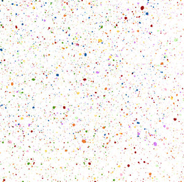

# 🚗 Cars 3D Slider

A fully responsive and animated 3D car image slider built with **HTML** and **CSS only** — no JavaScript required! This project showcases a rotating 3D carousel of car images using advanced CSS properties like `transform`, `perspective`, and `animation`, along with custom fonts and styling.

## 🧠 Features

* 🎠 **3D Circular Image Slider** – Pure CSS-based rotation animation
* 🧱 **Perspective Effects** – Creates a 3D illusion using `rotateX`, `rotateY`, and `translateZ`
* 🎨 **Modern Typography** – Uses custom web fonts like *Poppins*, *Work Sans*, and *ICA Rubrik*
* 💡 **Creative Layout** – Includes a dynamic title, author info, and a background model image
* ⚙️ **CSS Variables** – Easily customizable number of items and transforms
* ✅ **No JavaScript** – 100% functional with only HTML and CSS

## 📁 Project Structure

```
cars-3d-slider/
├── index.html
├── index.css
└── images/
    ├── img1.jpeg
    ├── img2.jpg
    ├── img3.jpg
    ├── img4.jpg
    ├── img5.jpg
    ├── img6.jpg
    ├── img7.avif
    ├── img8.jpg
    ├── cover.jpg
    └── model_img.png
```

## 🔧 How It Works

* Each image is placed in a `.item` div and positioned in 3D space using:

  ```css
  transform: rotateY(...) translateZ(...);
  ```
* The entire slider is animated with a CSS `@keyframes` rotation:

  ```css
  animation: autoRun 15s linear infinite;
  ```
* `--quantity` and `--i` custom properties help calculate spacing for circular placement.

## 👤 Author

**Souiki Zakarya Ayyoub**
🧑‍💻 Front-End Developer

> *"CSS is not just style — it's structure, animation, and creativity combined."*

## 🖼️ Preview

> 
> *(Add a live preview or screenshot here if needed)*

## 📦 Technologies Used

* **HTML5**
* **CSS3**
* Google Fonts + Custom CDN Fonts

## 📝 Customization

To add or remove images, simply update the `.slider` div:

```html
<div class="slider" style="--quantity:8;">
    <div class="item" style="--i:1"></div>
    ...
</div>
```

* `--quantity`: Total number of images
* `--i`: Index of the image (used to calculate rotation angle)

## ✅ License

This project is open-source and free to use for educational or personal use. Attribution to the author is appreciated.
